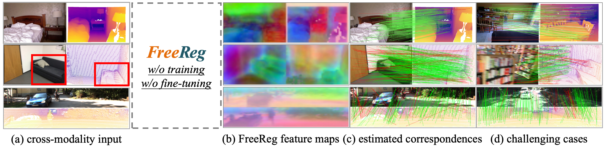
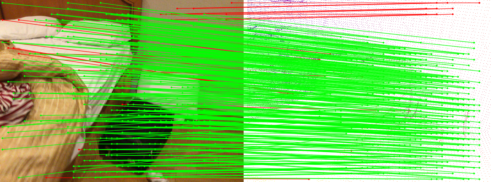

<h1 align="center"> <p>😍 FreeReg</p></h1>
<h3 align="center">
<a href="https://arxiv.org/abs/2310.03420" target="_blank">FreeReg: Image-to-Point Cloud Registration Leveraging Pretrained Diffusion Models and Monocular Depth Estimators</a>
</h3>

<h3 align="center">
ArXiv 2023
</h3>

<p align="center">
<a href="https://hpwang-whu.github.io/" target="_blank">Haiping Wang</a><sup>*,1</sup>, 
<a href="https://liuyuan-pal.github.io/" target="_blank">Yuan Liu</a><sup>*,2</sup>,
<a href="http://www.cs.ox.ac.uk/people/bing.wang/" target="_blank">Bing Wang</a><sup>3</sup>,
<a href="https://yujingsun.github.io/" target="_blank">Yujing Sun</a><sup>2</sup>,
<a href="https://dongzhenwhu.github.io/" target="_blank">Zhen Dong</a><sup>&dagger;,1</sup>, 
<a href="https://www.cs.hku.hk/people/academic-staff/wenping" target="_blank">Wenping Wang</a><sup>4</sup>
<a href="https://scholar.google.com/citations?hl=zh-CN&user=DZsF2oIAAAAJ" target="_blank">Bisheng Yang</a><sup>&dagger;,1</sup> <br>
</p>

<p align="center">
<sup>1</sup>Wuhan University &nbsp;&nbsp; 
<sup>2</sup>The University of Hong Kong &nbsp;&nbsp; 
<sup>3</sup>The Hong Kong Polytechnic University &nbsp;&nbsp; <br>
<sup>4</sup>Texas A&M University &nbsp;&nbsp; <br>
<sup>*</sup>The first two authors contribute equally. &nbsp;&nbsp; 
<sup>&dagger;</sup>Corresponding authors. &nbsp;&nbsp; 
</p>

<p align="center">
<strong>TL;DR: FreeReg extracts cross-modality features from pretrained diffusion models and monocular depth estimators for accurate zero-shot image-to-point cloud registration.</strong>
</p>


<p align="justify">
<strong>Abstract:</strong> Matching cross-modality features between images and point clouds is a fundamental problem for image-to-point cloud registration. However, due to the modality difference between images and points, it is difficult to learn robust and discriminative cross-modality features by existing metric learning methods for feature matching. Instead of applying metric learning on cross-modality data, we propose to unify the modality between images and point clouds by pretrained large-scale models first, and then establish robust correspondence within the same modality. We show that the intermediate features, called diffusion features, extracted by depth-to-image diffusion models are semantically consistent between images and point clouds, which enables the building of coarse but robust cross-modality correspondences. We further extract geometric features on depth maps produced by the monocular depth estimator. By matching such geometric features, we significantly improve the accuracy of the coarse correspondences produced by diffusion features. Extensive experiments demonstrate that <strong>without any task-specific training</strong>, direct utilization of both features produces accurate image-to-point cloud registration. On three public indoor and outdoor benchmarks, the proposed method averagely achieves a 20.6 percent improvement in Inlier Ratio, a three-fold higher Inlier Number, and a 48.6 percent improvement in Registration Recall than existing state-of-the-arts.
</p>

<p align="center">
 | 
<a href="https://arxiv.org/abs/2310.03420" target="_blank">Paper</a> | 
<a href="https://whu-usi3dv.github.io/FreeReg/" target="_blank">Project Page</a> | 
<a href="" target="_blank">Video</a>
 | 
</p>

## 🆕 News
- 2023-10-06: Code and Preprint paper ([Arxiv](https://arxiv.org/abs/2310.03420)) are aviliable! 🎉🎉

## 💻 Requirements
The code has been on:
- Ubuntu 20.04
- CUDA 11.7
- Python 3.8.5
- Pytorch 1.12.1
- GeForce RTX 4090.

## 🔧 Installation
- First, create the conda environment:
  ```
  conda env create -f environment.yaml
  conda activate freereg
  ```
- Second, fetch the latest [MiDaS](https://github.com/isl-org/MiDaS) repo via torch hub for Zoe:
  ```
  import torch
  torch.hub.help("intel-isl/MiDaS", "DPT_BEiT_L_384", force_reload=True)  # Triggers fresh download of MiDaS repo
  ```
- Third, install [MinkowskiEngine](https://github.com/NVIDIA/MinkowskiEngine) for FCGF:
  ```
  conda install openblas-devel -c anaconda
  git clone https://github.com/NVIDIA/MinkowskiEngine.git
  cd MinkowskiEngine
  python setup.py install --blas_include_dirs=${CONDA_PREFIX}/include --blas=openblas
  ```

## 🚅 Pretrained model
FreeReg does not need any training but utilizes pretrained models of existing projects:

- Diffusion Feature related, download them and place them in ```tools/controlnet/models``` directory: 
  - Stable Diffusion v1.5 [[ckpt]](https://huggingface.co/runwayml/stable-diffusion-v1-5/blob/main/v1-5-pruned.ckpt);
  - ControlNet(SDv1.5) conditioning on depth images [[ckpt]](https://huggingface.co/lllyasviel/ControlNet-v1-1/blob/main/control_v11f1p_sd15_depth.pth);

- Depth Estimation related, download them and place them in ```tools/zoe/models``` directory:
  - Zoe-depth-n [[ckpt]](https://github.com/isl-org/ZoeDepth/releases/download/v1.0/ZoeD_M12_N.pt) for indoor datasets such as 3dmatch/scannet;
  - Zoe-depth-nk [[ckpt]](https://github.com/isl-org/ZoeDepth/releases/download/v1.0/ZoeD_M12_NK.pt) for outdoor datasets such as kitti;

- Geometric Feature related, download them and place them in ```tools/fcgf/models``` directory:
  - FCGF-indoor [[ckpt]](https://drive.google.com/file/d/1cLFlKC_novdwFbxk6dtLlqOUlmynV7jc/view?usp=sharing);
  - FCGF-outdoor [[ckpt]](https://drive.google.com/file/d/1D6mKqzGqg9seeU3s2QJ7MEgHJPKxNo8F/view?usp=sharing)；
  - Or download FCGF models from [[Baidu-Disk]](https://pan.baidu.com/s/16-6osDbN8EaWRgT1dvUiQg)(code:35h9).

## 🔦 Demo
You can try FreeReg with the following command:
```
python demo.py
```
Then, you should obtain a ```demo.png``` that looks like:



## 💾 Dataset 
The datasets are accessible in [[Baidu-Disk]](https://pan.baidu.com/s/16-6osDbN8EaWRgT1dvUiQg)(code:35h9) and Google Cloud:

- [[3DMatch]](https://drive.google.com/file/d/1tSTlYFou6UEKR_UJa0Qm0Dy6foW4ubIs/view?usp=sharing);
- [[ScanNet]](https://drive.google.com/file/d/1wSoPzuAIZ3DFU1Gk2wcREXQG3jd9PW7s/view?usp=sharing);
- [[Kitti-DC]](https://drive.google.com/file/d/1c1TcUV2fMmXKK_vyZstVLD9J4-pCVCRu/view?usp=sharing).

Please place the data to ```./data```.

## ✏️ Test
To eval FreeReg on three benchmarks, you can use the following commands:
```
python run.py --dataset 3dmatch --type dg
python run.py --dataset scannet --type dg
python run.py --dataset kitti --type dg
```
you can replace ```--type dg``` that uses fused features and Kabsch solver with ```--type d``` for only using diffusion features and pnp solver or ```--type g``` for only using geometric features and Kabsch solver.

## 💡 Citation
If you find this repo helpful, please give us a 😍 star 😍.
Please consider citing FreeReg if this program benefits your project
```
@article{wang2023freereg,
  title={FreeReg: Image-to-Point Cloud Registration Leveraging Pretrained Diffusion Models and Monocular Depth Estimators},
  author={Haiping Wang and Yuan Liu and Bing Wang and Yujing Sun and Zhen Dong and Wenping Wang and Bisheng Yang},
  journal={arXiv preprint arXiv:2310.03420},
  year={2023}
}
```

## 🔗 Related Projects
We sincerely thank the excellent projects:
- [ControlNet](https://github.com/lllyasviel/ControlNet) for Diffusion Feature extraction;
- [Zoe-Depth](https://github.com/isl-org/ZoeDepth) for metric depth estimation on rgb images;
- [FCGF](https://github.com/chrischoy/FCGF) for Geometric Feature extraction;
- [IDC-DC](https://github.com/kujason/ip_basic) for depth completion.