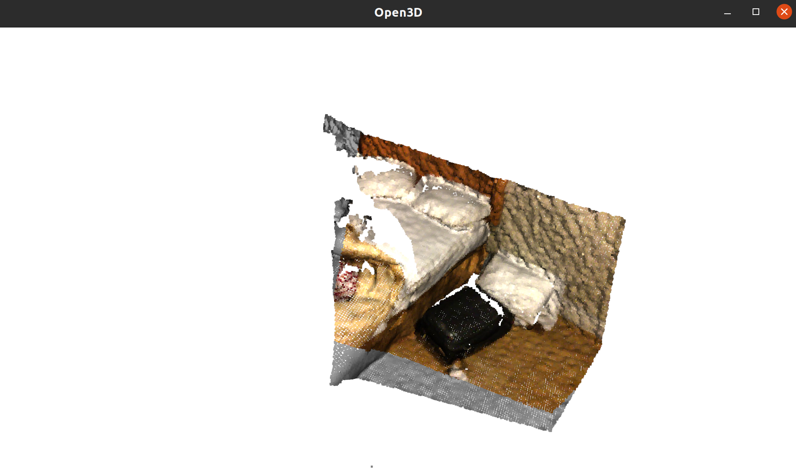
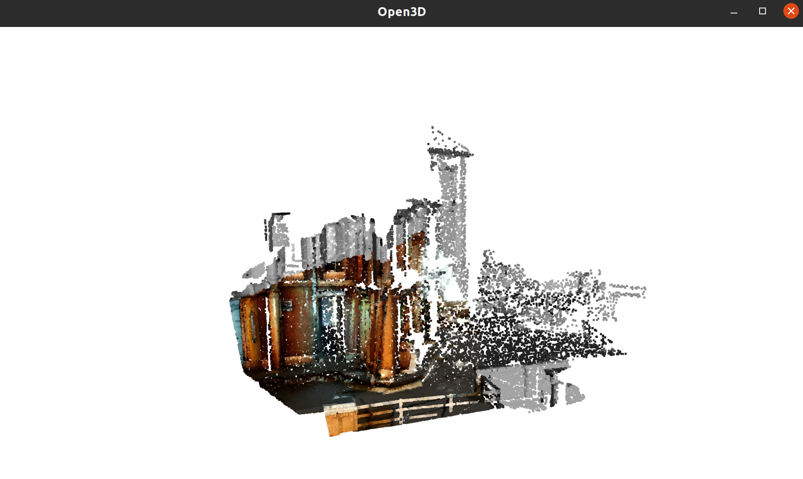

> **FreeReg: Image-to-Point Cloud Registration Leveraging Pretrained Diffusion Models and Monocular Depth Estimators**<br/>
> [Haiping Wang](https://hpwang-whu.github.io/), [Yuan Liu](https://liuyuan-pal.github.io/), [Bing Wang](https://www.polyu.edu.hk/aae/people/academic-staff/dr-wang-bing/), [Yujing Sun](https://yujingsun.github.io/), [Zhen Dong](https://dongzhenwhu.github.io/index.html), [Wenping Wang](https://www.cs.hku.hk/people/academic-staff/wenping), [Bisheng Yang](https://3s.whu.edu.cn/info/1025/1415.htm)<br/>
> *ICLR 2024*<br/>
> [**Paper**](https://arxiv.org/abs/2310.03420) | [**Project-page**](https://whu-usi3dv.github.io/FreeReg/) | [**Video**](https://www.youtube.com/watch?v=N_M5Zsfo1U8)

### 🔭 Why Free-FreeReg?
Both FreeReg and Free-FreeReg solve the relative pose between a pair of partially-overlapping point cloud and image. 
In FreeReg, we need to define a virtual camera to "take a depth picture" for the point cloud. 
This depth map is used to extract Diffusion features, denoated as FreeReg-D. 

We've demonstrated that FreeReg-D performs exceptionally well, 
but it requires two additional pieces of information for virtual camera defination: 
- One requirement is the camera's intrinsic parameters, which can be the same as the image's intrinsic parameters. 
- The other is the virtual camera's pose, which must produce a depth map that partially overlaps with the query image. 
In FreeReg, we define this initial pose as the identity matrix (demo.py), which corresponds to the initialization of the point cloud sensor's pose. 
Moreover, FreeReg-D is time-consuming for the diffusion process.

Though better performances, some users give suggestions for reducing time and storage requirements, as well as increasing ease of use (e.g., without defining a virtual camera). This is more suitable for users who need to use FreeReg rather than develop on it.

Fortunately, FreeReg-G does not require defining such a virtual camera and much faster, leading to this development called Free-FreeReg, an improved version of FreeReg-G. 
Free-FreeReg only needs the point cloud and image and solve the pose matrix of the image relative to the point cloud. 
Additionally, Free-FreeReg incorporates advanced image depth estimation technology, DepthPro, enhanced point cloud representation technology, YOHO, and a more reliable pose estimation method.

Therefore, if you only need FreeReg as a tool for image and point cloud registration, consider using the simple Free-FreeReg! 
If you are interested in the full details of FreeReg or the Diffusion Feature construction algorithm of FreeReg-D, or if you plan to make improvements based on FreeReg, you may need to learn how to define a "virtual camera"!

In summary:
|                             | FreeReg          | Free-FreeReg      |
|-----------------------------|------------------|-------------------|
| "virtual camera"            | Yes              | No                |
| "point cloud projection"    | Yes              | No                |
| "diffusion features"        | Yes              | No                |
| "geometric features"        | Zoe-Depth + FCGF | DepthPro + YOHO   |
| "training"                  | No               | No                |
| "performance"               | better           |                   |
| "do research"               | better           |                   |
| "efficiency"                |                  | better            |
| "usability"                 |                  | better            |

### 🔭 Use Free-FreeReg
#### 🔧 Installation
Besides the requirements of FreeReg, Free-FreeReg requires several other packages for DepthPro.
```
cd tools/DepthPro
pip install --upgrade pip
pip install timm==0.9.5
pip install -e .
cd ../..
```

#### 🚅 Pretrained models
Free-FreeReg still does not need any training but utilizes pretrained models of existing projects:
- DepthPro: Download [ckpt](https://ml-site.cdn-apple.com/models/depth-pro/depth_pro.pt) and place it to ```tools/DepthPro/checkpoints'''
- YOHO: 
    - Download [backbone-ckpt](https://github.com/HpWang-whu/YOHO/blob/master/model/Backbone/best_val_checkpoint.pth) and place it to ```tools/YOHO/model/Backbone''',
    - Download [yoho-ckpt](https://github.com/HpWang-whu/YOHO/blob/master/model/PartI_train/model_best.pth) and place it to ```tools/YOHO/model/PartI_train'''.

#### Run on demo data

```python demo.py --img demo/indoor/source_rgb.png --pcd demo/outdoor/target_pcd.ply```, then you should obtain a open3d window showing:


```python demo.py --img demo/outdoor/000198.png --pcd demo/outdoor/000189.npy```, then you should obtain a open3d window showing:


The output intrinsic is the one estimated by DepthPro. The output extrinsic is the point cloud (world) to camera tranformation.

#### Run on your own file
```python demo.py --img <your image dir in png/jpg> --pcd <your point cloud dir in pcd/ply/npy>```

Hyperparameters in Free-FreeReg is not well adjusted. We will release a detailed research report on some improvements of FreeReg and Free-FreeReg ASAP！

#### Make some improvements.
Free-FreeReg will achieve improvements if you use advanced metric monocular depth estimators or local descriptors.

## 💡 Citation
If you find this repo helpful, please give us a star.
Please cite FreeReg if this program benefits your project
```
@article{wang2023freereg,
  title={FreeReg: Image-to-Point Cloud Registration Leveraging Pretrained Diffusion Models and Monocular Depth Estimators},
  author={Haiping Wang and Yuan Liu and Bing Wang and Yujing Sun and Zhen Dong and Wenping Wang and Bisheng Yang},
  journal={arXiv preprint arXiv:2310.03420},
  year={2023}
}
```